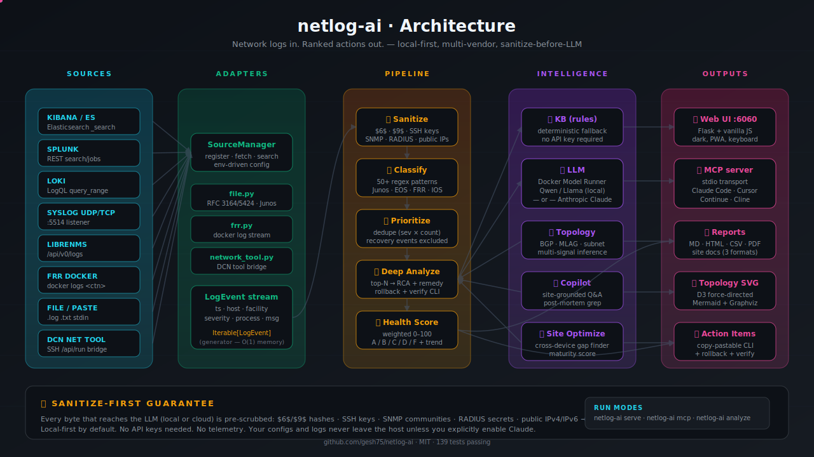

# netlog-ai

> **Network logs in. Ranked actions out.** A local, dark-themed dashboard that classifies syslog events from any vendor (Junos, Arista EOS, FRR), builds a prioritized action list, and lets an LLM write the root-cause analysis with copy-pastable CLI fixes.

   


---

## Why this exists

Most "AI for ops" tools either ship your data to a SaaS or hide what the model actually saw. **netlog-ai** runs entirely on your laptop:

- Configs and logs **never leave the host** — the LLM only sees pre-sanitized text (passwords, public IPs, SSH keys redacted before any outbound call).
- Pluggable LLM backend — **local Docker Model Runner** (Qwen, Llama) or **Anthropic Claude**. No telemetry, no API keys required for the local path.
- Every finding ships with **executable CLI**: Junos `set` lines, EOS `running-config` patches, FRR `vtysh` commands, plus a rollback block and verify steps.
- Built for **multi-vendor reality** — not a Cisco-only tool retrofitted with a chatbot.

If you have ever watched an AI dashboard hallucinate a "root cause" with no actionable next step, this is the antidote.

## What's new — connectors + MCP server

netlog-ai now ships a **pluggable connector layer** so it doesn't just analyze
pasted logs — it pulls from any common log source (full guide:
[docs/CONNECTORS.md](docs/CONNECTORS.md)).

| Connector  | Source              | One-line setup |
|------------|---------------------|----------------|
| `kibana`   | Elasticsearch / Kibana | `NETLOG_SOURCE_kibana_URL=… NETLOG_SOURCE_kibana_API_TOKEN=…` |
| `splunk`   | Splunk REST search  | `NETLOG_SOURCE_splunk_URL=… NETLOG_SOURCE_splunk_API_TOKEN=…` |
| `loki`     | Grafana Loki        | `NETLOG_SOURCE_loki_URL=… NETLOG_SOURCE_loki_API_TOKEN=…` |
| `syslog`   | UDP/TCP listener    | Zero-config — point any device at port 5514 |
| `librenms` | LibreNMS REST       | `NETLOG_SOURCE_librenms_URL=… NETLOG_SOURCE_librenms_API_TOKEN=…` |

And the analyzer engine is now **agent-callable** via a built-in MCP server:

```bash
pip install 'netlog-ai[mcp]'
netlog-ai mcp        # stdio transport — wire into Claude Code, Cursor, Continue
```

Tools exposed: `list_sources`, `add_source`, `fetch_logs`, `search_logs`,
`analyze_logs`, `get_top_offenders`, `list_sites`, `analyze_site`, plus
healthcheck + connector inventory. See [docs/CONNECTORS.md](docs/CONNECTORS.md)
for the full reference.

## Features

| | |
|---|---|
| 🔌 **Pluggable sources** | Kibana, Splunk, Loki, LibreNMS, syslog UDP/TCP — one Protocol, one config dict, hot-pluggable |
| 🤖 **MCP server mode** | Claude Code / Cursor / Continue can call the analyzer directly as agent tools |
| 🔎 **Classify** | 50+ regex patterns across Junos, EOS, FRR, IOS, RFC-3164/5424 |
| 🧭 **Prioritize** | Deduped action items, ranked by severity × count, recovery events excluded |
| 🧠 **Deep analyze** | Top-N items get an LLM-written root-cause + risk + remediation playbook |
| 🛡️ **Sanitize-first** | Every config/log payload is scrubbed (`$6$`, `$9$`, SSH keys, SNMP, RADIUS, public IPs) before LLM call |
| 📈 **Health score** | Weighted formula → 0–100 + A/B/C/D/F + sparkline trend |
| 🗺️ **Topology** | D3 force-directed map, inferred from configs (BGP peers, MLAG, interface descriptions, subnet co-membership) |
| 🤖 **Copilot** | Ask free-form questions, grounded in the selected site's configs |
| 🔍 **Post-mortem search** | Grep a pattern across every device in a site in one shot |
| 📄 **Report export** | Markdown / HTML / CSV / PDF + site documentation in 3 formats |
| ⌨️ **Keyboard-first** | `1/2/3` to switch tabs, `⌘/Ctrl+↵` to run, full ARIA + `:focus-visible` |
| 📱 **PWA-ready** | Installable on iOS/Android home screen; theme-color tinted dark |

## Quick start

```bash
git clone https://github.com/gesh75/netlog-ai.git
cd netlog-ai
python3 -m venv .venv && source .venv/bin/activate
pip install -e ".[dev]"
cp .env.example .env

# Run the UI
ai-log-analyzer serve
# → http://localhost:6060
```

Open the UI, pick a bundled site (`lab-alpha` or `lab-bravo`) under the **🌐 Site** tab, and hit **Analyze Whole Site**. Without an LLM key the rule-based knowledge base produces the analysis; with `ANTHROPIC_API_KEY` set, Claude writes a richer narrative.

### CLI

```bash
# List running FRR-lab containers (optional)
ai-log-analyzer containers

# Analyze a stream from any source
ai-log-analyzer analyze --frr r1 r2 --no-llm | jq .score
ai-log-analyzer analyze --file /var/log/syslog
docker logs my-router 2>&1 | ai-log-analyzer analyze --stdin

# Run the full test suite
pytest --cov=src --cov-report=term-missing
```

## Configure the LLM

Three providers, switchable at runtime from the UI dropdown — or via env / API:

| Mode          | Order |
|---------------|-------|
| `local`       | Local Docker Model Runner → falls back to Claude if `ANTHROPIC_API_KEY` is set |
| `claude`      | Claude first → falls back to local |
| `claude-only` | Claude only, no fallback |

```bash
LLM_PROVIDER=claude ANTHROPIC_API_KEY=sk-ant-... ai-log-analyzer serve

# Switch at runtime
curl -X POST localhost:6060/api/llm/provider \
  -H 'content-type: application/json' \
  -d '{"provider": "claude"}'

# Disable LLM entirely (rule-based KB only)
curl -X POST localhost:6060/api/llm/toggle \
  -H 'content-type: application/json' \
  -d '{"enabled": false}'
```

### Local LLM via Docker Model Runner

```bash
docker model pull ai/qwen3        # 8B, ~5GB, recommended
# or
docker model pull ai/llama3.2     # 3B, ~2GB, faster
docker model list                 # confirm
```

Auto-detected via TCP `:12434` first, then Unix sockets (`~/Library/Containers/com.docker.docker/Data/inference.sock` on macOS, `/run/docker-model-runner/inference.sock` on Linux).

## Bundled demo sites

Two **fully synthetic** site bundles ship in `sites/` so you can exercise every feature out of the box. These are not derived from any real network — they're hand-built configs designed to demonstrate the analyzer's full feature set.

| Site | Devices | Vendors | What it shows |
|------|---------|---------|----|
| `lab-alpha` | 5 (2 SRX HA pair + 1 MX router + 2 EOS switches) | Junos + EOS | Cross-vendor edge, chassis-cluster, MLAG |
| `lab-bravo` | 6 (1 SRX firewall + 2 MX spines + 3 EX leaves) | Junos | Spine/leaf fabric, iBGP full mesh |

Each bundle includes intentional configuration gaps (missing BFD, no LLDP on some access switches, IoT VLAN without an L3 interface) so the analyzer's deep-analysis pipeline produces concrete, actionable findings.

## Architecture

<p align="center">
  
</p>

> **Flow:** any source (Kibana, Splunk, Loki, syslog, LibreNMS, FRR, file) → `SourceManager` adapter → **sanitize → classify → prioritize → deep-analyze → score** → outputs (Web UI, MCP server, reports, topology, copy-pastable CLI). Every byte that touches the LLM is scrubbed first.

<details>
<summary>ASCII fallback (for terminals / RSS readers)</summary>

```
┌────────────────────────────────────────────────────────────────────┐
│                  Browser (vanilla JS, no build)                     │
│                  index.html + app.js                                │
└──────────────────────────────┬─────────────────────────────────────┘
                               │ HTTP / JSON
┌──────────────────────────────▼─────────────────────────────────────┐
│                Flask  (port 6060)                                   │
│                                                                     │
│  Adapters → Classifier → Action Items → Health Score → AI Summary  │
│     │           │              │              │             │       │
│     ▼           ▼              ▼              ▼             ▼       │
│  FRR docker  50+ regex     dedupe by    weighted formula  LLM or    │
│  File        patterns      (sev, desc)  → A/B/C/D/F       KB        │
│  Stdin/raw                                                          │
└─────────────────────────────────────────────────────────────────────┘
```

</details>

### Module layout

```
src/ai_log_analyzer/
  classifier.py        50+ regex patterns + severity/category lookup
  kb.py                Rule-based deep-analysis KB (fallback when LLM is off)
  llm.py               Docker Model Runner (TCP + UDS) + Anthropic Claude
  analyzer.py          End-to-end pipeline: classify → actions → score → summary
  copilot.py           Site-context Q&A with secret-sanitized prompts
  diff.py              Config-diff explainer
  sanitize.py          Pre-LLM redaction (passwords, public IPs, SSH keys)
  site_optimize.py     Site-wide cross-device gap finder + maturity score
  site_diagram.py      Mermaid + Graphviz DOT topology renderer
  topology.py          Build topology graph from device list
  topology_infer.py    Multi-signal edge inference (BGP, MLAG, descriptions, subnets)
  reports.py           MD / HTML / CSV / PDF report exporters
  adapters/
    frr.py             docker logs <container> → LogEvent stream
    file.py            RFC3164 / RFC5424 / Junos / freeform parser
  web/
    app.py             Flask routes + create_app()
    static/            index.html + app.js (no build step)
  cli.py               `ai-log-analyzer serve | analyze | containers`
```

## API

| Method | Endpoint | Description |
|--------|----------|-------------|
| `GET`  | `/api/health` | Liveness check |
| `GET`  | `/api/llm/status` | Provider + availability for each provider |
| `POST` | `/api/llm/provider` | `{"provider": "local"\|"claude"\|"claude-only"}` |
| `POST` | `/api/llm/toggle` | `{"enabled": true\|false}` |
| `GET`  | `/api/lab/containers` | Running FRR-lab container names |
| `GET`  | `/api/sites` | List bundled site bundles |
| `POST` | `/api/analyze` | Full pipeline — see request shapes below |
| `POST` | `/api/optimize` | Device-level config audit + patches |
| `POST` | `/api/optimize/site` | Cross-device site analysis |
| `POST` | `/api/optimize/site-wide/<id>` | Strategic maturity scoring + phased roadmap |
| `GET`  | `/api/topology/<id>` | Topology graph (JSON / Mermaid / DOT) |
| `GET`  | `/api/compliance/<id>` | Compliance rules pass/fail |
| `POST` | `/api/copilot` | Free-form Q&A grounded in selected site config |
| `POST` | `/api/postmortem/<id>` | Pattern search across all devices in a site |

### `/api/analyze` request

```json
{
  "source": "frr",
  "containers": ["r1", "r2"],
  "tail": 500,
  "use_llm": true
}
```

```json
{
  "source": "raw",
  "hostname": "test-router",
  "text": "Mar  3 12:00:01 r1 rpd[1234]: bgp peer 10.0.0.1 down\n..."
}
```

## Security defaults

- **Sanitize-before-LLM** — every config/log payload is run through `sanitize.py` before any outbound call. Coverage:
  - Linux/BSD shadow hashes (`$1$`, `$5$`, `$6$`)
  - Junos `$9$` proprietary encoding
  - SSH keys (RSA / Ed25519 / ECDSA / DSS)
  - SNMP communities, RADIUS / TACACS+ keys
  - IPsec pre-shared keys
  - Public IPv4 addresses (mapped to RFC-5737 doc prefixes for the LLM context)
- **Localhost bind by default** — set `ANALYZER_HOST=0.0.0.0` to expose; the server warns if you bind publicly without an `API_TOKEN`.
- **API-token gate** — set `API_TOKEN=...` to require `Authorization: Bearer ...` on every POST.
- **CORS allow-list** — `ANALYZER_CORS_ORIGINS=https://a.com,https://b.com`.
- **No telemetry** — outbound calls go only to (a) the LLM provider you select and (b) the local Docker socket if you analyze FRR-lab containers.

## Tested & accessible

- **139 unit + integration tests** (pytest, ~0.2s suite)
- Frontend audited across 8 review rounds:
  - WCAG-AA: `:focus-visible` rings, `aria-live` regions, `role=tablist/tab/tabpanel`, skip-to-main link, `prefers-reduced-motion` fallback
  - Responsive ≤ 1100px, PWA-ready (`theme-color`, `mobile-web-app-capable`, SVG favicon)
  - Performance: `content-visibility: auto` panel culling, `contain: layout`, deferred scripts, preconnect hint
  - Keyboard: `1/2/3` to switch tabs, `⌘/Ctrl+↵` to run, semantic `<kbd>` hints throughout
  - Print stylesheet for hardcopy reports

## Roadmap

- [ ] Multi-site comparison view (delta between two sites)
- [ ] Real-time tail mode (websocket stream of new events)
- [ ] PagerDuty / Slack alert webhooks per severity threshold
- [ ] More vendor adapters (Nokia SR Linux, Cisco IOS-XE, Cumulus NCLU)
- [ ] Snapshot / replay analysis runs for regression testing
- [ ] Custom rule editor in the UI

## Contributing

PRs welcome. See [CONTRIBUTING.md](CONTRIBUTING.md) for the short version. The whole stack is one `pip install -e ".[dev]" && pytest` away.

## License

MIT — see [LICENSE](./LICENSE).

---

Built by [@gesh75](https://github.com/gesh75) as part of a multi-vendor network automation toolkit.
