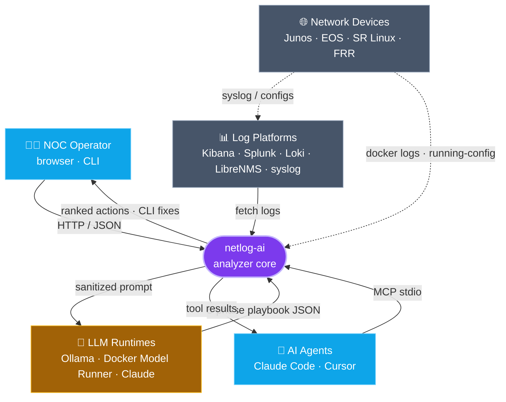
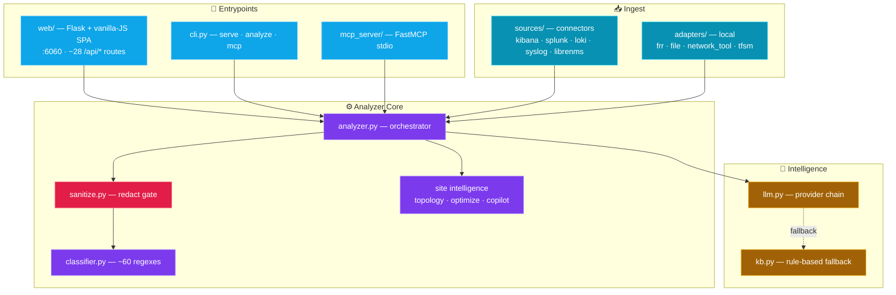
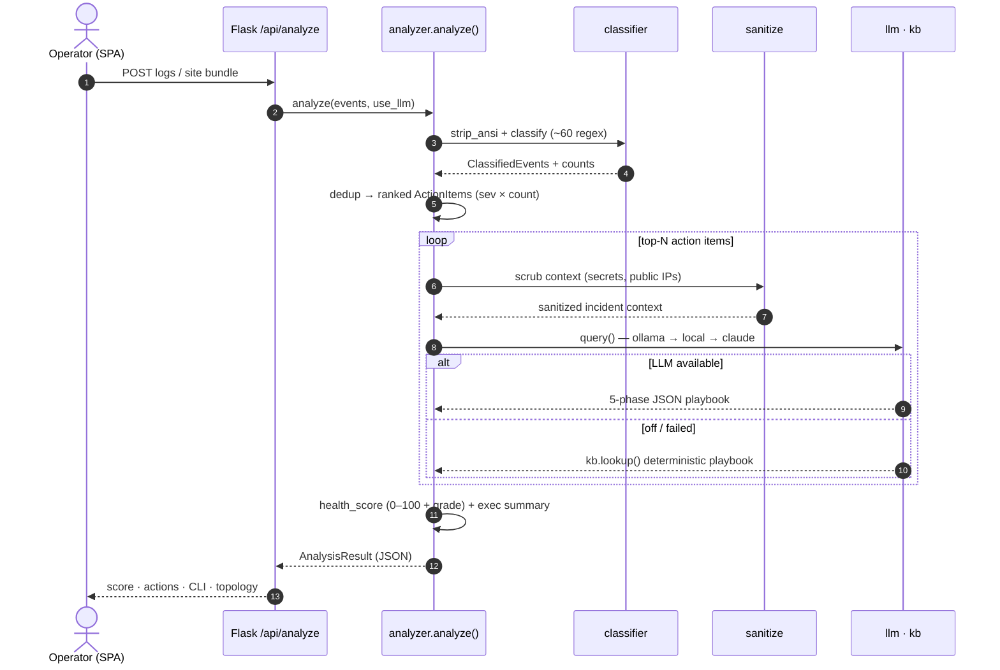
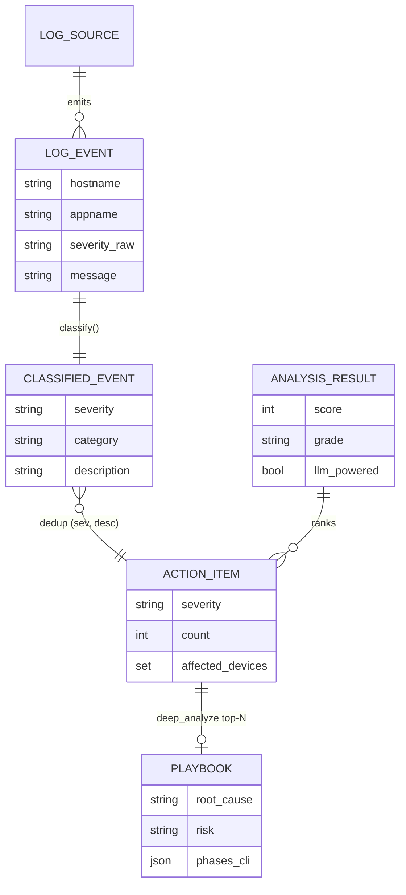
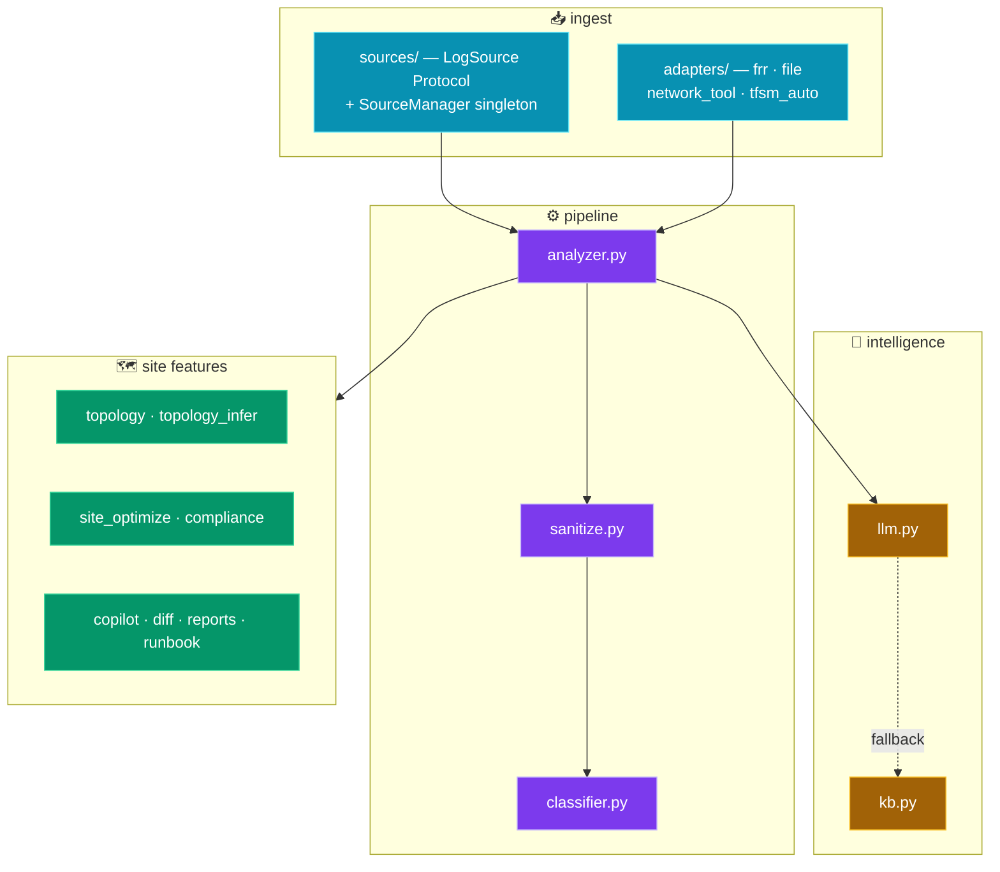

<p align="center">
  
</p>

# 🏛️ netlog-ai — Architecture

**netlog-ai** is a local-first, multi-vendor network log analyzer. It ingests syslog and CLI output from
Junos, Arista EOS, Nokia SR Linux and FRR (via pluggable connectors or local adapters), classifies events with a
~60-pattern regex knowledge base, deduplicates them into a severity-ranked action list, and lets an LLM
(local Ollama / Docker Model Runner, or Anthropic Claude) write a 5-phase root-cause playbook with
copy-pastable per-vendor CLI fixes. Its defining invariant is **sanitize-before-LLM** — every config and log
is scrubbed of secrets and public IPs before any outbound call — and it degrades gracefully to a deterministic
rule-based KB when no model is available. The same analyzer core is exposed three ways: a no-build Flask +
vanilla-JS dashboard (port 6060), a CLI, and an MCP server for agent clients like Claude Code.

---

## Table of Contents

1. [System Context](#1-system-context)
2. [Container & Component Map](#2-container--component-map)
3. [Primary Flow — `POST /api/analyze` (sequence)](#3-primary-flow--post-apianalyze-sequence)
4. [Data Flow — the analysis pipeline](#4-data-flow--the-analysis-pipeline)
5. [LLM Provider Fallback (state machine)](#5-llm-provider-fallback-state-machine)
6. [Core Data Model (ER)](#6-core-data-model-er)
7. [Module Map](#7-module-map)
8. [Tech Stack](#8-tech-stack)

---

## 1. System Context

The analyzer core sits between four classes of external actor: the human operators who drive it (browser,
CLI, or AI agents over MCP), the log platforms it pulls from, the LLM runtimes it can call, and the network
devices that are the ultimate source of logs and configs. Every outbound LLM call is gated by the sanitizer.



---

## 2. Container & Component Map

Three entrypoints (Flask UI, CLI, MCP server) all wrap a single shared analyzer core. The core is layered:
an ingest layer (connectors + adapters), the always-on sanitize gate, the deterministic classifier, the
pipeline orchestrator, and the pluggable intelligence backends (LLM client and rule-based KB).



---

## 3. Primary Flow — `POST /api/analyze` (sequence)

The end-to-end runtime path: the Flask route builds `LogEvent` records, the analyzer classifies and ranks
them, sanitizes context, and asks the LLM for a structured playbook — falling back to the rule-based KB if the
model is off or fails — then scores health and returns the assembled JSON to the SPA.



---

## 4. Data Flow — the analysis pipeline

Data moves strictly left-to-right and transforms at each stage: raw lines become normalized events, events
become classified findings, findings dedup into ranked actions, and the top items receive deep analysis —
always passing through the sanitize gate before any LLM call.

```mermaid
flowchart LR
    RAW["📝 Raw lines<br/>syslog · CLI · paste"]
    EV["LogEvent<br/>frozen records"]
    CE["ClassifiedEvent<br/>sev · category"]
    AI["ActionItem stack<br/>ranked sev × count"]
    GATE{{"🛡️ sanitize gate"}}
    DEEP["Deep analysis<br/>5-phase playbook"]
    SCORE["Health score<br/>0–100 + A–F"]
    OUT["📤 Outputs<br/>SPA · CLI · MCP · reports"]

    RAW -->|adapters / connectors| EV
    EV -->|strip_ansi + regex KB| CE
    CE -->|dedup · drop recovery| AI
    AI -->|top-N context| GATE
    GATE -->|LLM or rule KB| DEEP
    AI --> SCORE
    DEEP --> OUT
    SCORE --> OUT

    classDef raw   fill:#0891b2,stroke:#67e8f9,color:#fff
    classDef stage fill:#7c3aed,stroke:#c4b5fd,color:#fff
    classDef gate  fill:#e11d48,stroke:#fb7185,color:#fff
    classDef score fill:#059669,stroke:#34d399,color:#fff
    classDef out   fill:#a16207,stroke:#fbbf24,color:#fff

    class RAW,EV raw
    class CE,AI,DEEP stage
    class GATE gate
    class SCORE score
    class OUT out
```



---

## 5. LLM Provider Fallback (state machine)

`llm.query()` walks a provider fallback chain so the dashboard always returns *something*. If every model path
is exhausted or disabled, control returns `None` and the caller drops to the deterministic rule-based KB —
the tool never hard-fails on a missing model.

```mermaid
stateDiagram-v2
    [*] --> Ollama: provider = local
    Ollama --> DMR: no response
    DMR --> Claude: no response / no socket
    Claude --> RuleKB: API error / disabled

    Ollama --> Done: text returned
    DMR --> Done: text returned
    Claude --> Done: text returned
    RuleKB --> Done: deterministic playbook

    Done --> [*]

    note right of Ollama
        :11434 native /api/chat
    end note
    note right of DMR
        Docker Model Runner
        :12434 + unix socket
    end note
    note right of RuleKB
        kb.lookup() — always
        emits actionable output
    end note
```

---

## 6. Core Data Model (ER)

The pipeline is built on a small set of immutable dataclasses. A `LogEvent` is classified into a
`ClassifiedEvent`; classified events deduplicate into `ActionItem`s; each top item carries a `Playbook`; and the
whole run is assembled into one `AnalysisResult`.



---

## 7. Module Map

`src/ai_log_analyzer/` is organized by responsibility: ingest packages feed the core, the core orchestrates
classify → sanitize → analyze → score, intelligence backends supply the deep analysis, and a layer of
site-aware features operates over whole-fabric config bundles.



---

## 8. Tech Stack

| Layer | Technologies |
|---|---|
| **Language** | Python 3.10+ (frozen dataclasses, `typing.Protocol`, `re`) |
| **Web / API** | Flask 3 · flask-cors · gunicorn · vanilla JS · Cytoscape.js + ELK |
| **Ingest** | `requests` · raw AF_UNIX socket HTTP · `subprocess` (docker CLI) · optional tfsm-fire / TextFSM |
| **Intelligence** | Ollama · Docker Model Runner (OpenAI-compat) · Anthropic Claude (`claude-haiku-4-5`) · rule-based KB |
| **Security** | `hashlib` (sha256 stable tokens) · `ipaddress` · sanitize-before-LLM gate · X-API-Token · CORS allow-list |
| **Agent surface** | MCP SDK (FastMCP, optional) over stdio / streamable-http |
| **Packaging** | `pyproject.toml` console scripts (`ai-log-analyzer` / `netlog-ai`) · Docker · docker-compose |

---

<p align="center"><sub>Generated architecture documentation · diagrams render natively on GitHub via Mermaid.</sub></p>
